# Slidown

[English](#english) | **Português** | [Español](#español)


---

## English

**Slidown** is a native macOS app for downloading videos and audio as simply as possible — paste the link, hit a button, done. Built with SwiftUI from the ground up to look and behave like a proper native app: it uses standard macOS components, follows the system's light/dark appearance automatically, and doesn't try to reinvent anything Apple has already solved well.

Under the hood, Slidown is powered by **[yt-dlp](https://github.com/yt-dlp/yt-dlp)** — a highly respected, community-maintained open source project responsible for understanding and downloading content from hundreds of different sites. Slidown doesn't replace yt-dlp; it wraps it in a friendly, native, localized interface, handling all the tedious parts (fetching the right binary, keeping it updated, managing the queue, auto-detecting the site) so you never have to touch a terminal.

Available in **6 languages**: English, Portuguese, Spanish, French, Japanese, and Chinese — the interface automatically follows your Mac's system language.

### Key features
- Fully native interface, following macOS design standards
- Download queue with simultaneous or "slow mode" (avoids rate limits on sensitive sites)
- Per-site profiles with automatic detection
- Remote access over the same Wi-Fi network — works from any phone, tablet, or computer on the network, not just iPhone (paste a link from any device, the Mac downloads it)
- Automatic updates for both the internal tools and the app itself, no manual reinstall needed
- Available in 6 languages, following your system language automatically

### Screenshots

<table>
<tr><td align="center"><b>Download</b></td><td align="center"><b>Downloads folder</b></td></tr>
<tr>
<td>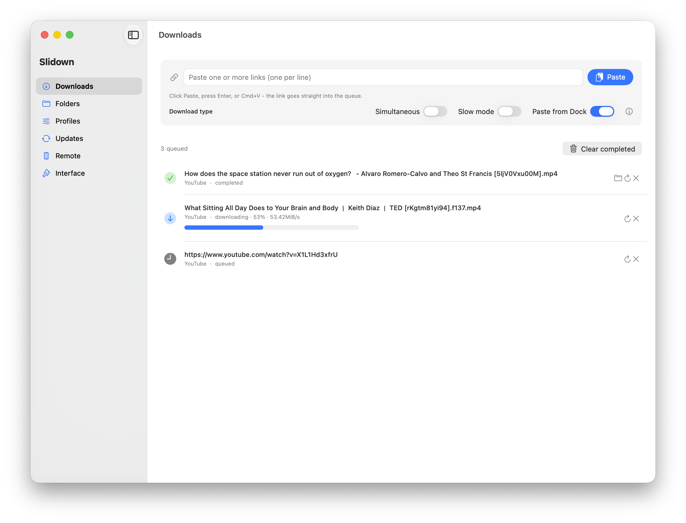</td>
<td>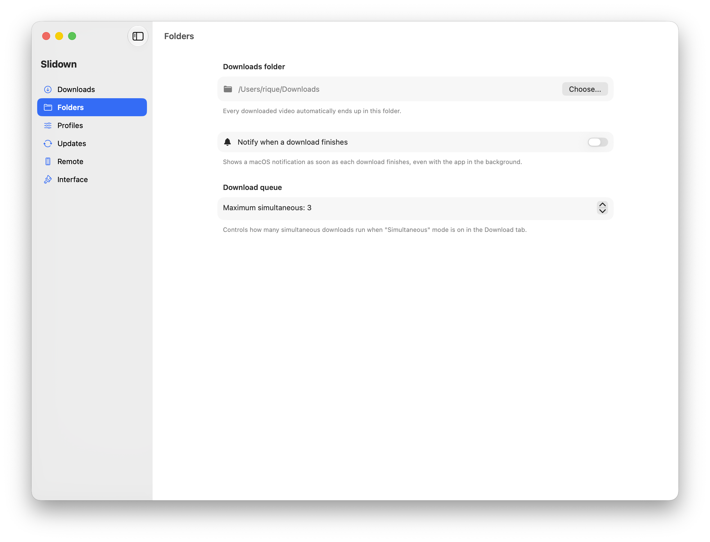</td>
</tr>
<tr><td align="center"><b>Profiles</b></td><td align="center"><b>Updates</b></td></tr>
<tr>
<td>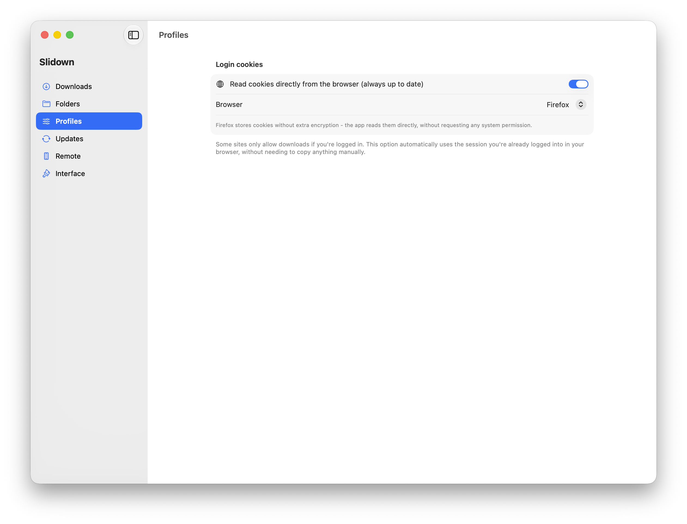</td>
<td>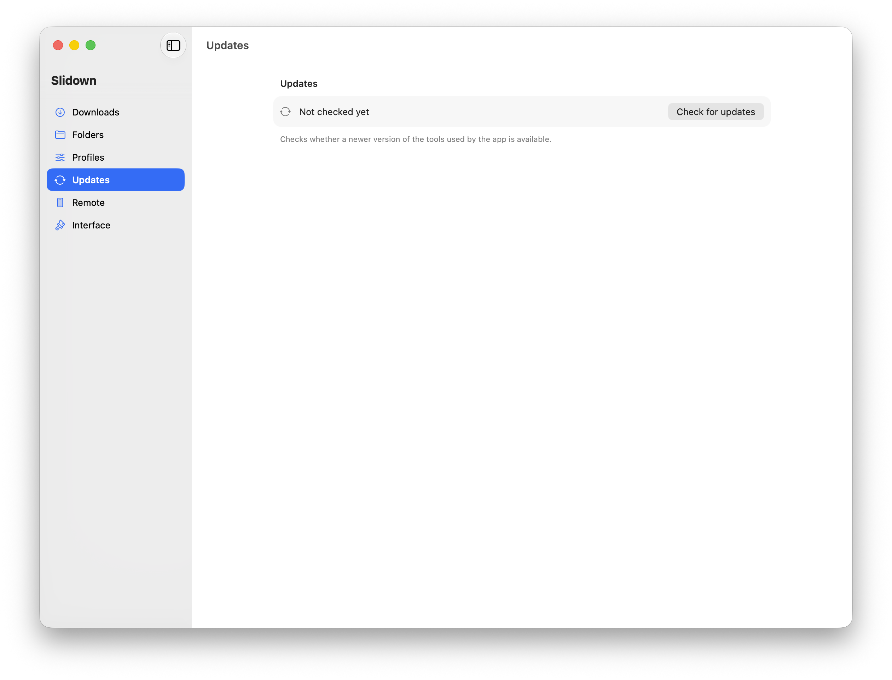</td>
</tr>
<tr><td align="center"><b>Remote access</b></td><td align="center"><b>Interface settings</b></td></tr>
<tr>
<td>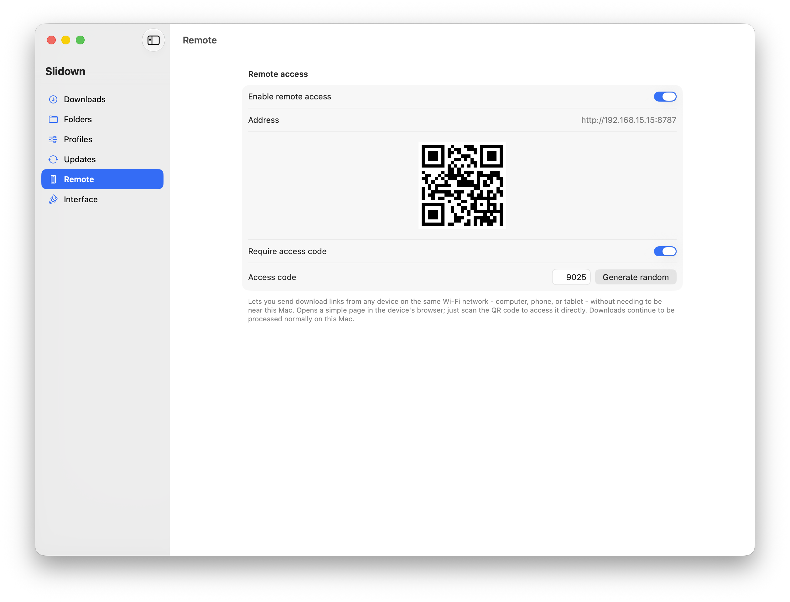</td>
<td>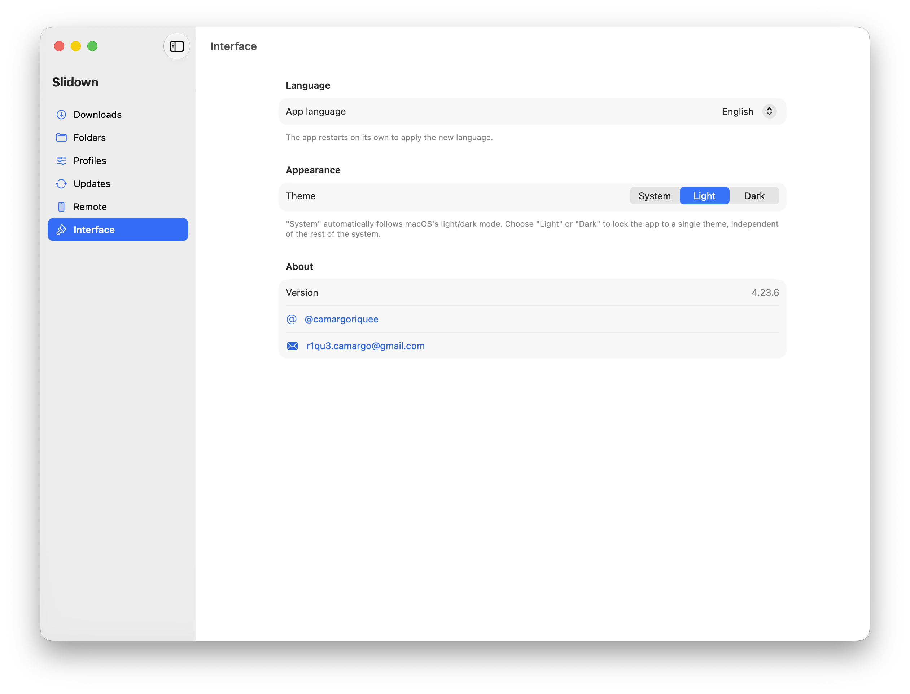</td>
</tr>
<tr><td align="center" colspan="2"><b>Mobile page (opened from a phone on the same network)</b></td></tr>
<tr><td colspan="2" align="center">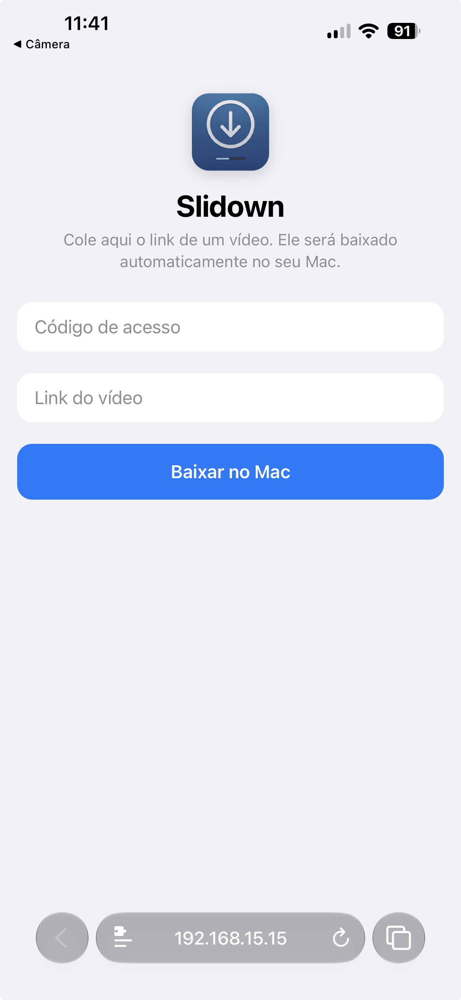</td></tr>
</table>

<details>
<summary>Dark mode</summary>
<table>
<tr><td align="center"><b>Download</b></td><td align="center"><b>Downloads folder</b></td></tr>
<tr>
<td>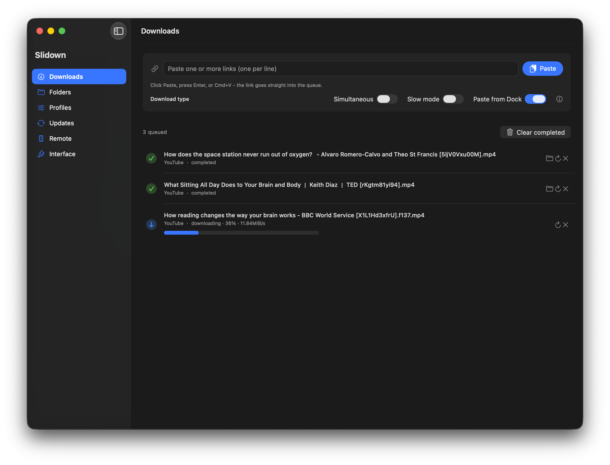</td>
<td>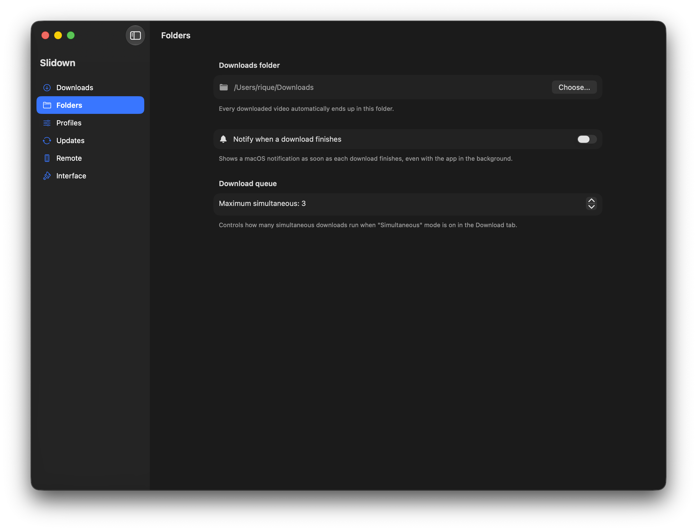</td>
</tr>
<tr><td align="center"><b>Profiles</b></td><td align="center"><b>Updates</b></td></tr>
<tr>
<td>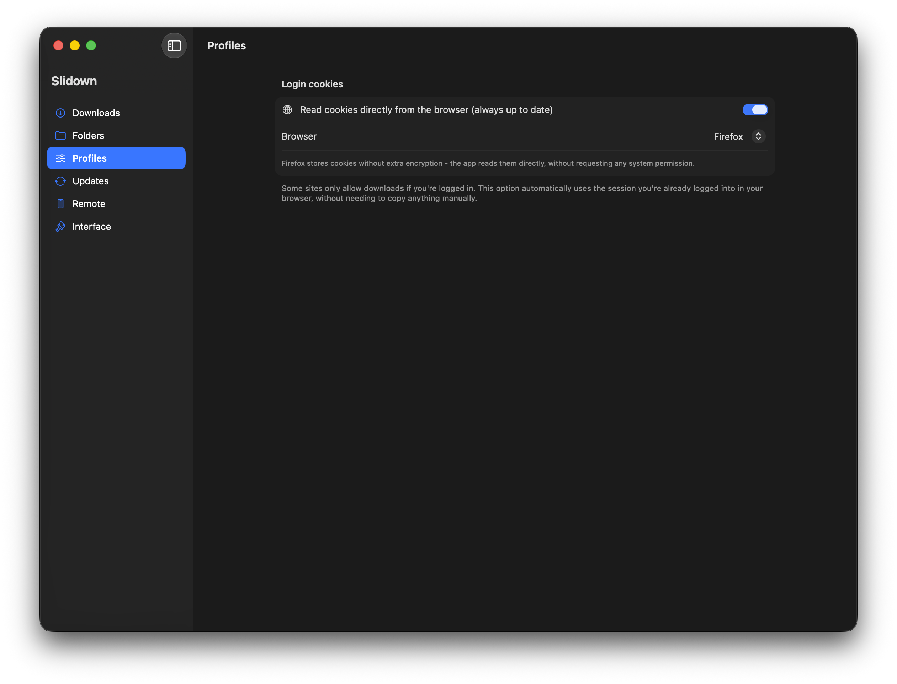</td>
<td>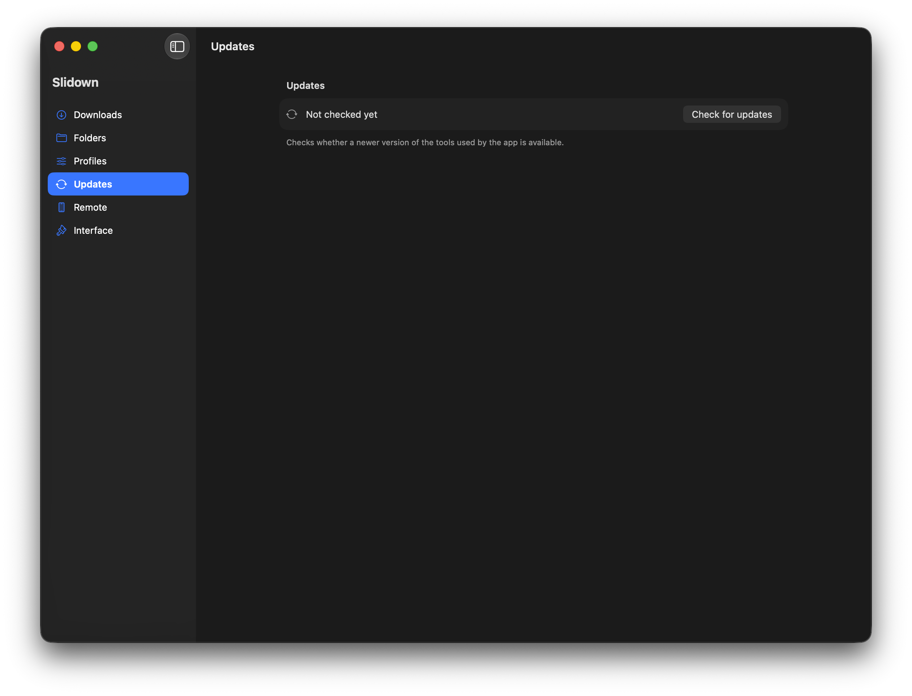</td>
</tr>
<tr><td align="center"><b>Remote access</b></td><td align="center"><b>Interface settings</b></td></tr>
<tr>
<td>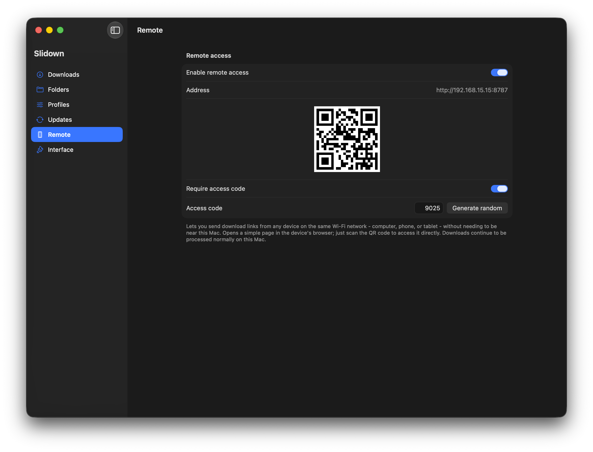</td>
<td>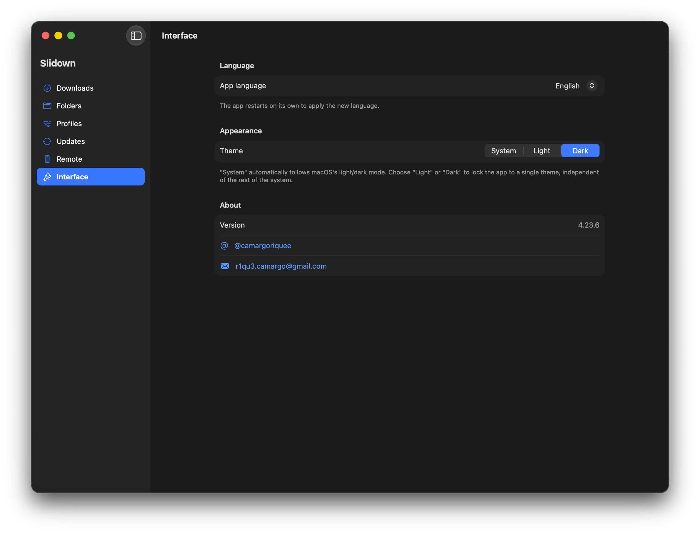</td>
</tr>
<tr><td align="center" colspan="2"><b>Mobile page (opened from a phone on the same network)</b></td></tr>
<tr><td colspan="2" align="center">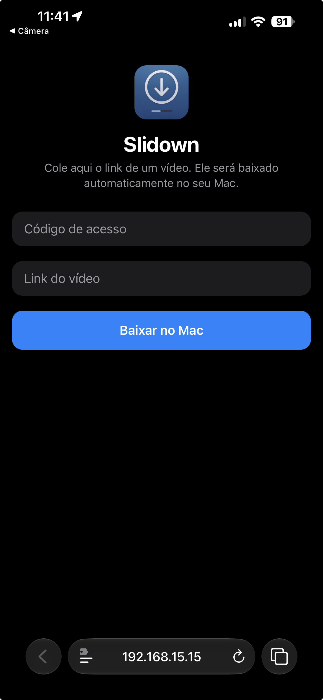</td></tr>
</table>
</details>

### Requirements
- **macOS Tahoe (26) or later**
- Internet connection (only needed to fetch internal tools and the videos themselves)

### Installation
1. Download the latest `.zip` from the [Releases](../../releases) tab
2. Unzip it and drag `Slidown.app` into your Applications folder

> ### ⚠️ Important: this app is not signed by Apple
> Slidown is an independent personal project and **has not gone through Apple's paid notarization process**. Because of this, **macOS will block it on first launch** with an "unidentified developer" warning — this is expected, not an error. You need to do one of the following **before it will open**:
>
> - **Simplest**: right-click on `Slidown.app` → **Open** → confirm on the prompt that appears (only needed once)
> - **Via Terminal**: open Terminal and run this command (adjust the path if you installed it elsewhere):
>   ```
>   xattr -cr /Applications/Slidown.app
>   ```
>
> This is standard behavior for any app distributed outside the App Store, not an issue specific to Slidown — but skipping this step means the app simply won't open.

### No ads, ever
Slidown shows no ads, sells no data, and has no commercial tracking of any kind built in. It's a personal tool, built for personal use.

### Disclaimer
Slidown is a technical convenience tool. Responsible use — respecting copyright and each site's terms of service — is the responsibility of the person using the app. This project does not host, distribute, or have any relationship with the content downloaded through it.

---

## 🇧🇷 Português

**Slidown** é um app nativo de macOS pra baixar vídeos e áudios da forma mais simples possível — cola o link, aperta um botão, pronto. Feito com SwiftUI, pensado desde o início pra parecer (e se comportar) como qualquer app nativo do sistema: usa os componentes visuais padrão do macOS, respeita claro/escuro automaticamente, e não tenta reinventar nada que a Apple já resolveu bem.

Por baixo dos panos, o Slidown usa o **[yt-dlp](https://github.com/yt-dlp/yt-dlp)** — um projeto open source extremamente respeitado e mantido pela comunidade, responsável por entender e baixar conteúdo de centenas de sites diferentes. O Slidown não substitui o yt-dlp, ele só coloca uma interface amigável, nativa e em português por cima dele, cuidando de toda a parte chata (baixar o binário certo, manter atualizado, organizar a fila, detectar o site automaticamente) pra você não precisar tocar em terminal nenhum.

Disponível em **6 idiomas**: português, inglês, espanhol, francês, japonês e chinês — a interface acompanha automaticamente o idioma do sistema do seu Mac.

### Principais funcionalidades
- Interface 100% nativa, seguindo os padrões visuais do macOS
- Fila de downloads com modo simultâneo ou "modo lento" (evita bloqueios em sites sensíveis)
- Perfis por site, com detecção automática de qual configuração usar
- Acesso remoto pela mesma rede Wi-Fi — funciona de qualquer celular, tablet ou computador na rede, não só iPhone (cola o link de qualquer dispositivo, o Mac baixa)
- Atualização automática das ferramentas internas e do próprio app, sem precisar reinstalar manualmente
- Disponível em 6 idiomas, acompanhando automaticamente o idioma do sistema

### Capturas de tela

<table>
<tr><td align="center"><b>Baixar</b></td><td align="center"><b>Pasta de downloads</b></td></tr>
<tr>
<td></td>
<td></td>
</tr>
<tr><td align="center"><b>Perfis</b></td><td align="center"><b>Atualizações</b></td></tr>
<tr>
<td></td>
<td></td>
</tr>
<tr><td align="center"><b>Acesso remoto</b></td><td align="center"><b>Interface</b></td></tr>
<tr>
<td></td>
<td></td>
</tr>
<tr><td align="center" colspan="2"><b>Página aberta pelo celular, na mesma rede</b></td></tr>
<tr><td colspan="2" align="center"></td></tr>
</table>

<details>
<summary>Modo escuro</summary>
<table>
<tr><td align="center"><b>Baixar</b></td><td align="center"><b>Pasta de downloads</b></td></tr>
<tr>
<td></td>
<td></td>
</tr>
<tr><td align="center"><b>Perfis</b></td><td align="center"><b>Atualizações</b></td></tr>
<tr>
<td></td>
<td></td>
</tr>
<tr><td align="center"><b>Acesso remoto</b></td><td align="center"><b>Interface</b></td></tr>
<tr>
<td></td>
<td></td>
</tr>
<tr><td align="center" colspan="2"><b>Página aberta pelo celular, na mesma rede</b></td></tr>
<tr><td colspan="2" align="center"></td></tr>
</table>
</details>

### Requisitos
- **macOS Tahoe (26) ou mais recente**
- Conexão com a internet (só pra baixar as ferramentas internas e os próprios vídeos)

### Instalação
1. Baixa o `.zip` mais recente na aba [Releases](../../releases)
2. Descompacta e arrasta o `Slidown.app` pra pasta Aplicativos

> ### ⚠️ Importante: esse app não é assinado pela Apple
> O Slidown é um projeto pessoal independente e **não passou pelo processo de notarização da Apple** (que é pago). Por causa disso, **o macOS vai bloquear a primeira abertura** com um aviso de "desenvolvedor não identificado" — isso é esperado, não é erro. Você precisa fazer um dos dois abaixo **antes do app conseguir abrir**:
>
> - **Mais simples**: clica com o botão direito em cima do `Slidown.app` → **Abrir** → confirma no aviso que aparece (só precisa fazer isso uma vez)
> - **Via Terminal**: abre o Terminal e roda esse comando (ajusta o caminho se instalou em outro lugar):
>   ```
>   xattr -cr /Applications/Slidown.app
>   ```
>
> Isso é uma característica normal de qualquer app distribuído fora da App Store, não é um problema específico do Slidown — mas pular essa etapa significa que o app simplesmente não vai abrir.

### Sem publicidade, nunca
O Slidown não mostra anúncios, não vende dados, não tem nenhum tipo de rastreamento comercial embutido. É uma ferramenta pessoal, feita pra uso pessoal.

### Aviso legal
O Slidown é uma ferramenta de conveniência técnica. O uso responsável — respeitando direitos autorais e os termos de serviço de cada site — é de responsabilidade de quem usa o app. O projeto não hospeda, distribui nem tem qualquer relação com o conteúdo baixado através dele.

---

## Español

**Slidown** es una app nativa de macOS para descargar videos y audio de la forma más simple posible — pega el enlace, presiona un botón, listo. Construida con SwiftUI desde el principio para verse y comportarse como cualquier app nativa del sistema: usa los componentes visuales estándar de macOS, respeta el modo claro/oscuro automáticamente, y no intenta reinventar nada que Apple ya haya resuelto bien.

Por debajo, Slidown funciona con **[yt-dlp](https://github.com/yt-dlp/yt-dlp)** — un proyecto de código abierto muy respetado y mantenido por la comunidad, responsable de entender y descargar contenido de cientos de sitios diferentes. Slidown no reemplaza a yt-dlp, solo le pone una interfaz amigable, nativa y localizada encima, encargándose de toda la parte tediosa (descargar el binario correcto, mantenerlo actualizado, organizar la cola, detectar el sitio automáticamente) para que nunca tengas que tocar una terminal.

Disponible en **6 idiomas**: español, inglés, portugués, francés, japonés y chino — la interfaz sigue automáticamente el idioma del sistema de tu Mac.

### Funcionalidades principales
- Interfaz 100% nativa, siguiendo los estándares visuales de macOS
- Cola de descargas con modo simultáneo o "modo lento" (evita bloqueos en sitios sensibles)
- Perfiles por sitio, con detección automática de cuál configuración usar
- Acceso remoto por la misma red Wi-Fi — funciona desde cualquier celular, tablet o computadora en la red, no solo iPhone (pega el enlace desde cualquier dispositivo, la Mac lo descarga)
- Actualización automática de las herramientas internas y de la propia app, sin reinstalación manual
- Disponible en 6 idiomas, siguiendo automáticamente el idioma del sistema

### Capturas de pantalla

<table>
<tr><td align="center"><b>Descargar</b></td><td align="center"><b>Carpeta de descargas</b></td></tr>
<tr>
<td></td>
<td></td>
</tr>
<tr><td align="center"><b>Perfiles</b></td><td align="center"><b>Actualizaciones</b></td></tr>
<tr>
<td></td>
<td></td>
</tr>
<tr><td align="center"><b>Acceso remoto</b></td><td align="center"><b>Interfaz</b></td></tr>
<tr>
<td></td>
<td></td>
</tr>
<tr><td align="center" colspan="2"><b>Página abierta desde el celular, en la misma red</b></td></tr>
<tr><td colspan="2" align="center"></td></tr>
</table>

<details>
<summary>Modo oscuro</summary>
<table>
<tr><td align="center"><b>Descargar</b></td><td align="center"><b>Carpeta de descargas</b></td></tr>
<tr>
<td></td>
<td></td>
</tr>
<tr><td align="center"><b>Perfiles</b></td><td align="center"><b>Actualizaciones</b></td></tr>
<tr>
<td></td>
<td></td>
</tr>
<tr><td align="center"><b>Acceso remoto</b></td><td align="center"><b>Interfaz</b></td></tr>
<tr>
<td></td>
<td></td>
</tr>
<tr><td align="center" colspan="2"><b>Página abierta desde el celular, en la misma red</b></td></tr>
<tr><td colspan="2" align="center"></td></tr>
</table>
</details>

### Requisitos
- **macOS Tahoe (26) o posterior**
- Conexión a internet (solo para descargar las herramientas internas y los propios videos)

### Instalación
1. Descarga el `.zip` más reciente en la pestaña [Releases](../../releases)
2. Descomprímelo y arrastra `Slidown.app` a la carpeta Aplicaciones

> ### ⚠️ Importante: esta app no está firmada por Apple
> Slidown es un proyecto personal independiente y **no pasó por el proceso de notarización pago de Apple**. Por eso, **macOS va a bloquear la primera apertura** con un aviso de "desarrollador no identificado" — esto es esperado, no es un error. Necesitas hacer uno de los dos pasos siguientes **antes de que la app pueda abrirse**:
>
> - **Más simple**: clic derecho sobre `Slidown.app` → **Abrir** → confirma en el aviso que aparece (solo hace falta una vez)
> - **Vía Terminal**: abre la Terminal y ejecuta este comando (ajusta la ruta si lo instalaste en otro lugar):
>   ```
>   xattr -cr /Applications/Slidown.app
>   ```
>
> Esto es un comportamiento normal de cualquier app distribuida fuera de la App Store, no un problema propio de Slidown — pero saltar este paso significa que la app simplemente no se abrirá.

### Sin publicidad, nunca
Slidown no muestra anuncios, no vende datos, no tiene ningún tipo de rastreo comercial integrado. Es una herramienta personal, hecha para uso personal.

### Aviso legal
Slidown es una herramienta de conveniencia técnica. El uso responsable —respetando derechos de autor y los términos de servicio de cada sitio— es responsabilidad de quien usa la app. El proyecto no aloja, distribuye ni tiene ninguna relación con el contenido descargado a través de él.
